<h1 align="center">treeHouse</h1>

<a href="https://treehouse-shop.herokuapp.com/"><h2>View live project here</h2></a>

## About

This is an e-commerce website for a fictional eco-homeware business. The goal of the website is to allow customers to browse products, create an account, purchase products and store information about themselves, their purchase history and items they want to add to a wishlist. Also the site administrator can exercise CRUD functionality on products, and blogs for customers to read and comment on. It features STRIPE's payments processer and will allow a user to make a purchase using the following card details; card num: 4242 4242 4242 4242, any date and any cvv. Submition of those details will complete the order, please don't use your own card details.

## Screenshot

### Home Page

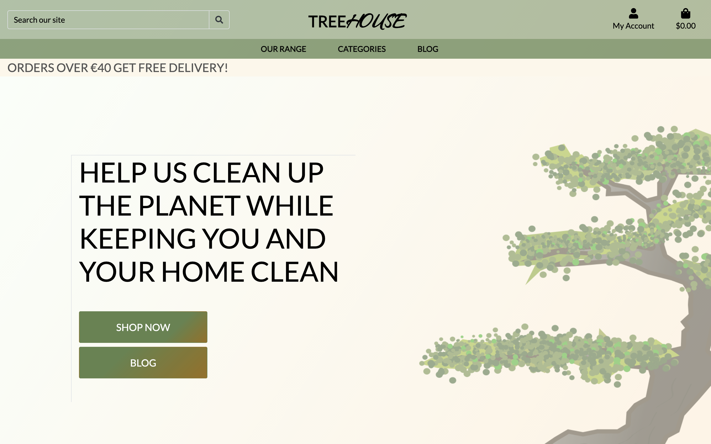

## User Experience

### User Stories

- Customers
  - Website experience
    - As a customer, I would like to see what the website is selling.
    - I would like to be able to navigate the website easily.
    - I would like to see some information about the company.
    - As a customer, I would like to be able to contact the company.
  
  - Product.
    - As a customer, I would like to see all the products the company sells.
    - I would like to be able to search by category.
    - I would like to be able to search through the products.
    - I would like to sort the items by price.

  - Shopping.
    - As a customer, I would like to see the product price and description.
    - I would like to be able to add products to my shopping cart.
    - I would like to be notified when I complete interactions with the site.
    - I would like to be able to edit my shopping cart.
    - I would like to be able to checkout easily.
    - I would like to receive confirmation of my order.

  - Account.
    - As a customer, I would like to save my details to an account.
    - I would like to see my previous order details.
    - I would like to leave a review of the company.

- Website administrator.
  - As a site administrator, I would like to be able to edit and add products easily.
  - I would like to be able to delete products.
  - I would like to have access to an admin section. 
  - I would like my customers to be able to shop on the site easily.

## Mockups

### Mobile

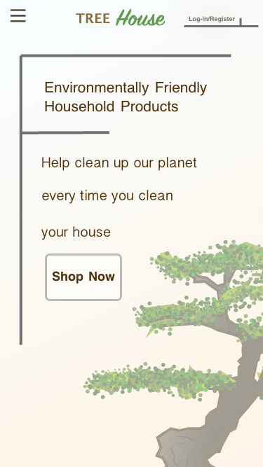 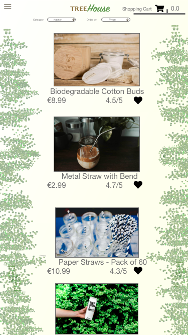 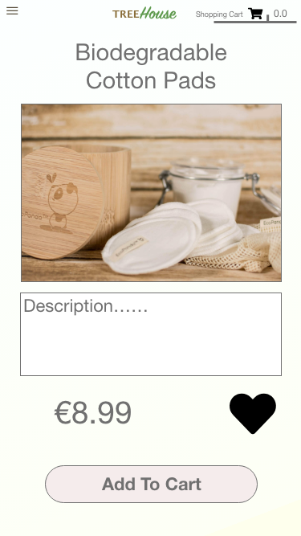 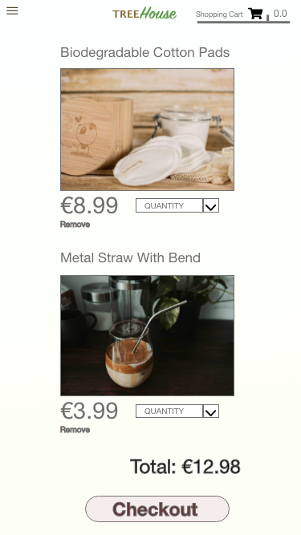

### Tablet

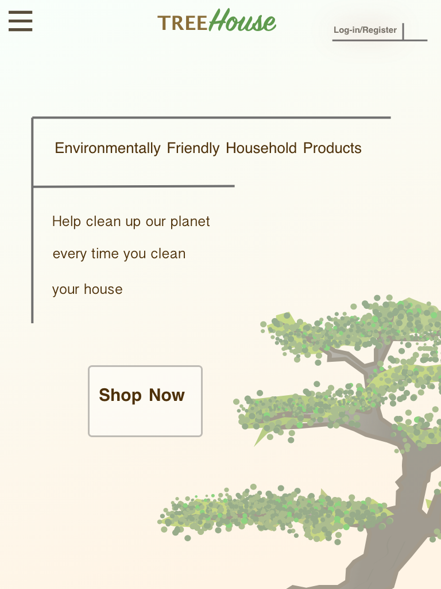 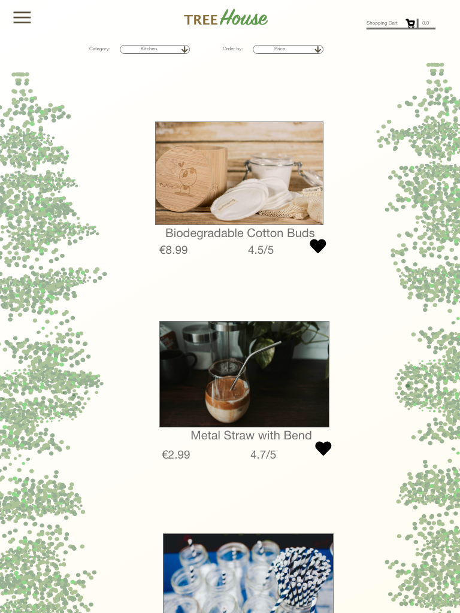 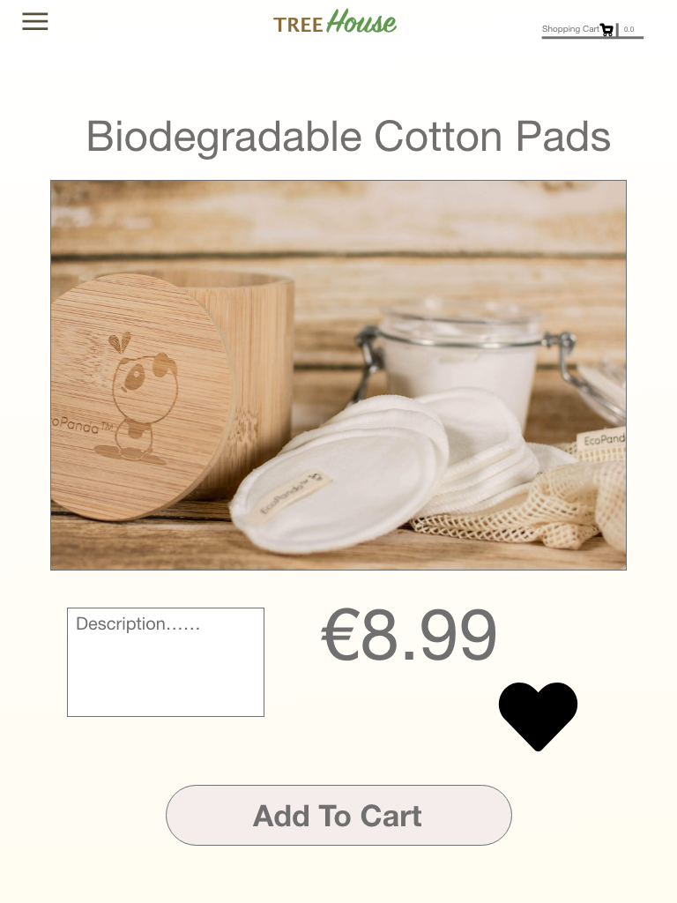 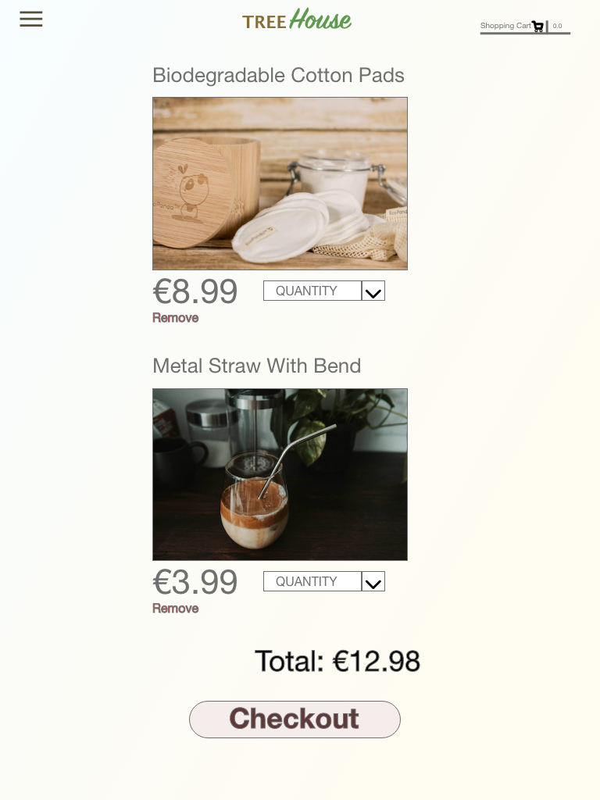

### Desktop

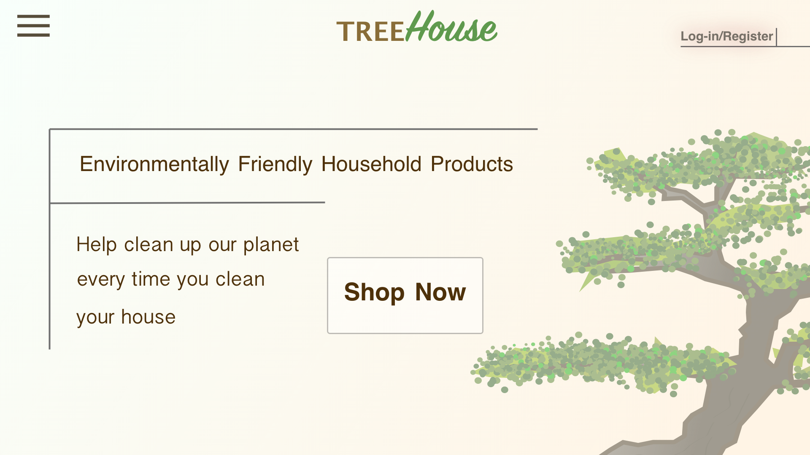
-
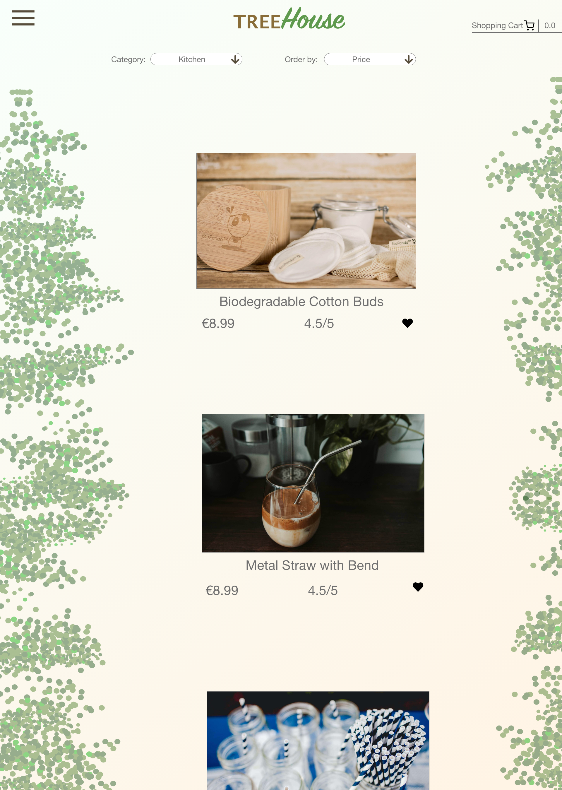
-
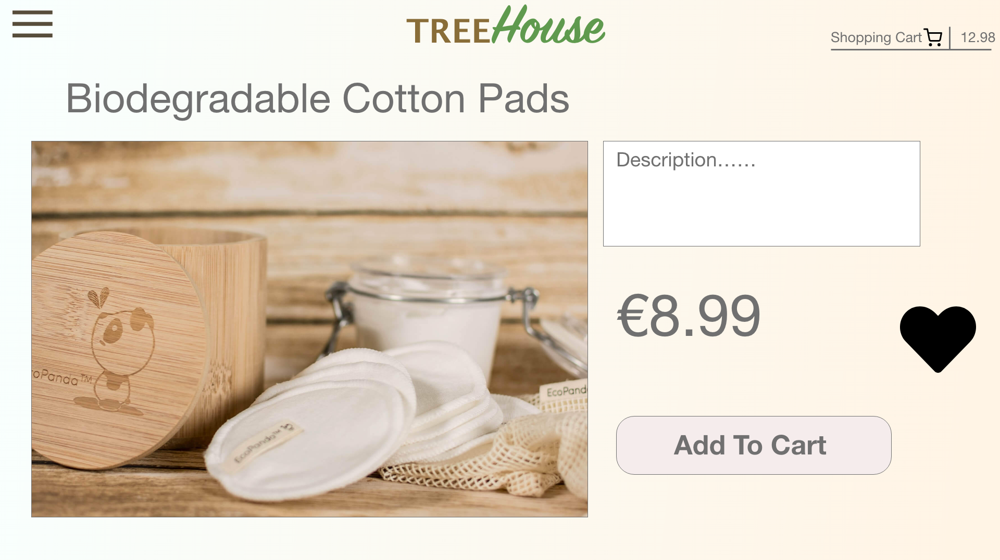
-
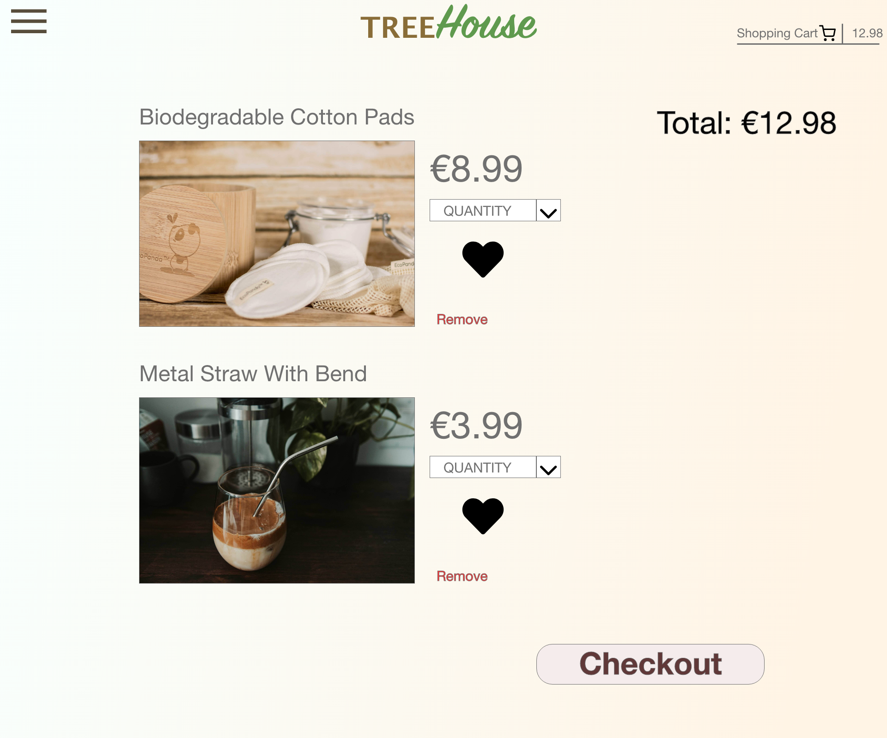

## Database Models

- #### Models
- Profiles
  - User
    - From Django Allauth; contains their username, email, and password.
  - Userprofile
    - Model containing the user's address, phone number and username.
 
- Favourites
  - Users' Favourites
    - Contains products that the user has added to their favourites list.

- Products 
  - Products
    - Contains all the information for each product.
  - Categories
    - The categories all the products fall in to.

- Checkout
  - Order
    - Contains the details of orders a customer has made and the products they've purchased.
  - Orderline item
    - Products of the customer order, quantities and the total price.

- Blog
  - Post
    - Contains blog posts, their title and author.
  - Comments
    - Contains the comments entered under each post.

- Database Diagram

  - This databse diagram shows each object, its keys and relationships between them.
  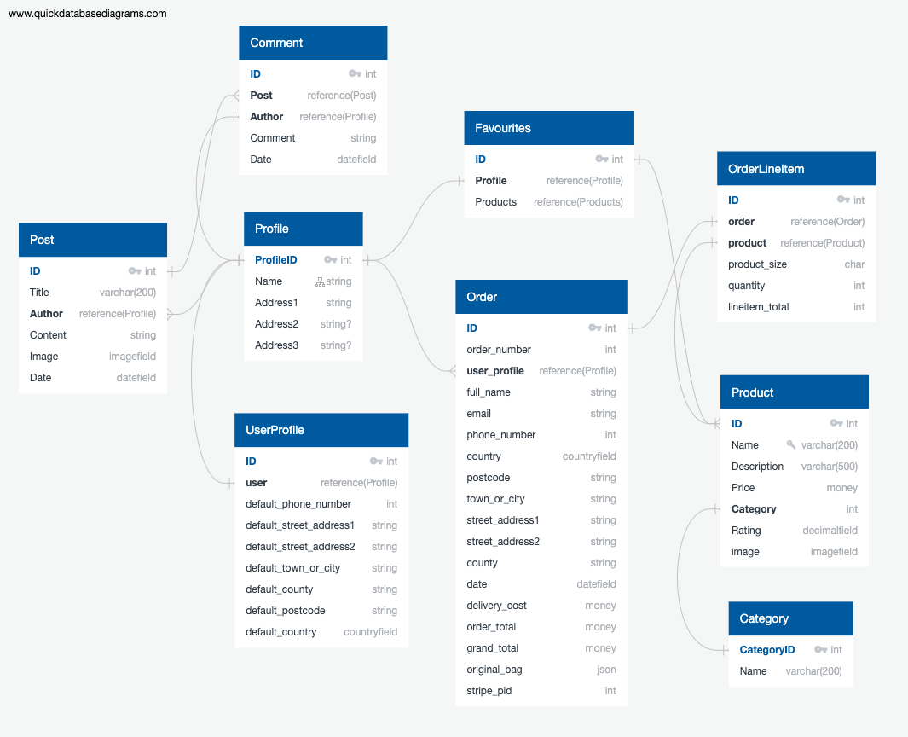

## Design

- The design of the website was inspired by a treehouse with a colour scheme dominated by greens, browns and beige. This lends itself to an eco aesthetic which matches the theme of the website, sustainable homeware.

- All the different shades of green and the gradient of the beige background with spots of brown should be perfect in representing the treehouse experience in simple colour.

- The fonts chosen from google fonts for the header "treeHouse" are Lato and Caramel. These are characteristic of the strong tree trunk and the elegant branches of leaves. This combination also could evoke the image of a treehouse.

- I used icons from font-awesome for relevant inputs, navigation and dropdown menu. For the "add to favourites" button I used a heart symbol, the obvious choice and emblematic of a like button.

## Features

### Landing Page

- This is a static page which features everything the user needs to navigate the site and understand it's purpose. The message "HELP US CLEAN UP THE PLANET WHILE KEEPING YOU AND YOUR HOME CLEAN" lets the user know the mission of the site. It also points directly to the kind of products for sale without requiring the user to read a paragraph or two about the aim of the e-commerce shop.
- The large "Shop Now" button immediately below the message is ideally placed below the question to suggest to the user the best way they can help us clean up the planet.
- The Blog button gives them an option to become more informed about the mission of the site and the stories of people leading eco-lives.
- The message below the header tells the user that they can get free delivery with a purchase over €40. A welcome message which doesn't obtrude on the page greatly.
- The header contains a search bar, the title and a couple of icons for navigation. One of the icons is a person indicating personal/user info, it triggers a dropdown menu with links relating to the user's profile. The other icon is a link to the shopping cart and also displays a running total of it's contents beneath it.
- There is a bottom section to the header which displays dropdown links for the range of products and one for the csategories for the user to easily navigate to their preferred products from the homepage.

### Products Page

- The products page extends the base template and features a "sort by" selecter and gives the user the number of products displayed by the given search or category.
- Products can be sorted by price, category, or alphabetically.
- If a category has been selected the category is diplayed below the "Products" heading.
- The products are displayed in rows of 4, 3, 2, or 1 depending on the width of the page, from large to small.
- The images are capped at a max height so that they don't stand out too much in their row given the different image shapes that could be uploaded.
- Beneath the image is the name of the product, the price and the category that it's in.
- If the user clicks on the category below they will be presented with all products of that category.
- There is a heart icon to the bottom left of the product that the user can click to add the product to their favourites list.
- As the user scrolls down the page through the products the bottom part of the header and the free delivery announcment slide out of view to give them a better view of the products.
- The header is also transparent so it doesn't impare the view more than it needs to while remaining clear if the user does wish to use it.

#### Product Detail Page

  - This page displays a larger image of the product with some information about it and a review in stars out of 5.
  - The product can be added to the users shopping basket from here with an "add to cart" button.
  - There is quantity selector so the user can choose how many of the product they wish to add.
  - The heart icon is also on this page so it can be added to favourites from here also.

### Shopping Bag

- When the user has finished shopping they can click the icon in the top left corner and be brought to the bag page.
- This page allows the user to look at the products they have in their cart and edit them.
- There is a quantity selector next to the products for the user to add to or reduce the number of an item. They would then click the update button below to register the change.
- A remove button allows them to remove a product immediately if they wish.
- The price for each item is displayed to the side and a total is displayed at the bottom with a message letting them know how far from a free delivery they are if the total is less than €40.
- The checkout now button is just below, directing straight to a payments page.
- When a product has been added to the cart it will trigger a dropdown displaying the contents of the bag, the toal price and a link to go directly to checkout.

### The Checkout

- For not logged in users, users who have not signed up or logged in users making their first purchase, the user will be required to give their details.
- The customer will be prompted if they enter values in an incorrect format for the required field.
- To the right of the field entries there is summary of their order with the total displayed.
- After entering in the card details (card num: 4242 4242 4242 4242) and submitting them, they will be directed to an order confirmation page.
- The user is thanked and given information about their order.

### Favourites

- The favourites page consists of all the products the user has favourited.
- It is a wishlist that the user can keep indefinitely.
- They need to have an account to be able to add things to a favourites page.
- All items they have favourited in the past will appear here.
- They can remove items from the wishlist by clicking on the dash icon beneath each product.
- They can empty the list entirely by clicking the "empty favourites" button. This will open up a modal asking them to confirm that this action is correct.

### The Profile Page

- The user can change their details here; phone number and address.
- They will see a order history list as well, with a link to each of those orders.
- When the user clicks on the link they will be brought to the order confirmation page with the same information displayed on it. A message stating that this is an old order will also appear.

### The Blog

- This page shows all the blog posts created by the site administrator.
- The administrator can add new blog posts from here or edit/delete existing posts.
- The user can click on the image or the read more tab and open up the blog post.
- Here they will see an enlarged cover photo for the blog and the blog post content below.
- At the bottom of that page they will be able to add a comment or delete existing comment's they have written.

## Testing

### Testing User Stories

- Customers
  - Website experience
    -  As a customer, I would like to see what the website is selling.
        - The customer can see from the message on the landing page that the items are for home and personal cleaning.
        - If they enter the blog they will see stories of individuals who try change their home products and habits.
    - I would like to be able to navigate the website easily.
      - There are all the important shopping related links visible in the navbar and dropdowns for profile related pages.
      - The mobile navbar has all the main pages the user could access on the site so they are never more than a click away from where they might want to go.
      - The style of the links are intuitive with their icons and the buttons stand out from the page.
    - As a customer, I would like to know what the company's goal is.
      - The message on the homepage is minimalist but sends a clear message about the site's goals.
      - The blog gives the user more information about the mission of the site.
  
  - Product.
    - As a customer, I would like to see all the products the company sells.
      - From the homepage the user can click to immediately shop and browse through all the items.
      - The products page displays all items in a well structured layout which makes it easy for them to see and search through all products.
    - I would like to be able to search by category.
      - The sort by input above the items will allow the user to show the category they want to explore, sorting by category.
      - The category dropdown in the navbar lets them select the category they'd like to search through leaving out any items outside that category.
      - The category an item is in, named below the product, is a link to display products only from that category.
    - I would like to be able to search through the products.
      - The search bar in the navbar allows users to search keywords in the title or description of a product and will display all which match that/those keywords.
    - I would like to sort the items by price.
      - The sort by selector at the top of the products page allows the user to organise the items by their price, category, or alphabetically, in ascending or descending order.

  - Shopping.
    - As a customer, I would like to see the product price and description.
      - The price of each product is displayed below the items when displayed on the products page.
      - The price and description can be read when the product detail page is opened by clicking on the product.
      - Once added to the cart, the items will have their price listed beside them.
    - I would like to be able to add products to my shopping bag.
      - Once the user has clicked on a product they will be able to add it straight to the cart.
      - On the product detail page their is a link to click to add that product to the bag.
    - I would like to be notified when I complete interactions with the site.
      - Their are toast messages which appear when any notable action has been taken on the site.
      - They have colours which represent the tone of the message so that the user is made aware of the type of message it is without reading it; error - red, success - green, etc.
    - I would like to be able to edit my shopping bag.
      - On the shopping bag page there is a number adjuster beside each item to change the amount of a product you would like to purchase.
      - There is a button to remove an item from the cart without delay and a button to update the number of a product being ordered.
    - I would like to be able to checkout easily.
      - The checkout button at the bottom brings the user straight to a page where they can put in their details and complete the order.
      - A popup message appears whenever an item has been added to the bag so the user can choose to head straight to the bag and checkout anywhere on the site.
      - The bag icon in the top right corner of the navbsr serves the same function.
    - I would like to receive confirmation of my order.
      - The customer will recieve an email confirming their order has been placed and will contain the details of that order.
      - When the order is submitted the user is brought to a confirmation page thanking them and listing the details of the order.
      - On their profile page they can confirm the orders in their history and open up the same confirmation page.

  - Account.
    - As a customer, I would like to save my details to an account.
      - When completing an order a user can check a box which will save their details to their account so that they do not have to reenter them for the next order.
      - The user will be prompted to set up an account if they are purchasing items without an account.
    - I would like to see my previous order details.
      - The profile page contains all the orders a user has made previously.
      - The user can click on the links of orders on their profile page to see details of previous orders.
      - Their email history will also help them maintain a record of purchases.

- Website administrator.
  - As a site administrator, I would like to be able to edit and add products easily.
    - The site administrator is presented with a link to edit items on the products page. This page provides them with an easy to use form to fill out the details to edit the product.
    - In the profile icon dropdown there is a "product management" link for adding new products. This also includes an easy to fill out form
    - If they are a superuser they can access django's admin to editand add products from there.
  - I would like to be able to delete products.
    - The site administrator is presented with a link to delete items on the products page.
    - A modal will appear when attempting to delete to avoid the accidental deletion of products.
    - If they are a superuser they can delete products from the django admin.
  - I would like to have access to an admin section.
    - The product management presents the administrator with an admin section for adding products.
    - The editing an item page provides the same.
    - The django admin pages allow for complete adjusting of products, categories and accounts on the site.
  - I would like my customers to be able to shop on the site easily.
    - As outlined in the customer experience, a user has all they could want to navigate the site and purchase products with absolute ease.

### Django Unit Testing

  - Django unit testing was used to test the functionality of the site automatically.
  - Tests were written for all of the views in each app.
  - To run the tests, the following command is run:
    - python3 manage.py test
  - All tests run with no errors or fails.
  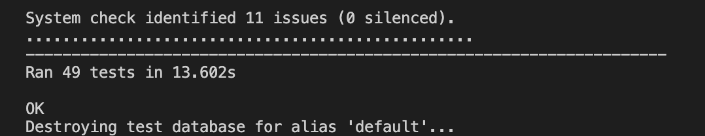

### Bugs

  - There were no significant bugs discovered during the development of the website or in the testing phase.
  - Responsivity issues and style conflicts were rectified during the creation of the site but no notable errors or failures of the back-end.

### Manual Testing

#### Personal

  - I created customer accounts, added items to the bag, deleted some, checked out items, added comments to blog posts, deleted them, edited user information, added items to my favourites, deleted them, and repeated these steps on different screen sizes.
  - I created admin accounts to test editing, adding, and deleteing of products and blog posts, and repeated this on different screen sizes.
  - All the forms were tested to see if they would accept incorrect formats as inputs.
  - No issues were found at time of submition.

#### Friends and Family

  - I had friends and family of all different ages and abilities to test the website out and no issues were found.
  - Some styling changes, like the addition of a heart icon for the add to favourites functionality, were made off the back of feedback received in this stage of testing.

### Validators

#### W3C was used to test the css and it passed.
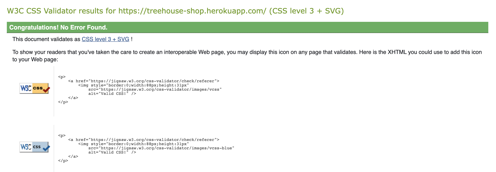
-
-

#### I used JSHint to test my JavaScript and it passed.
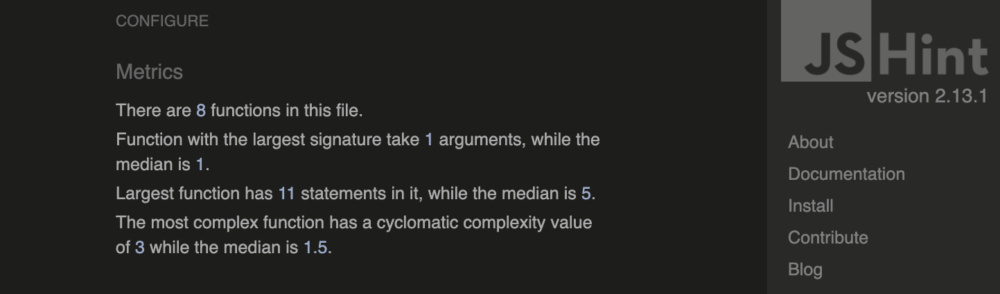

## Technologies Used

- The website was built using the Django framework

### Languages Used

- HTML5
- CSS3
- JavaScript
- Python

### Django Extensions

- Django Allauth
- Django Countries
- Django Crispy Forms

### Other Technologies

- Stripe 
  - For payments
- Heroku
  - Deployment
- Amazon AWS
  - Static and image storage
- Gunicorn
  - For deplying to Heroku
- Google Fonts
  - Fonts
- Font Awesome
  - Icons
- Bootstrap 5
  - Styling and layout
- Quick Database Diagrams
  - For database model
- AdobeXD
  - For the mock-ups

### Compatibility Testing
- Browser Compatibility

    | Screen size\Browser | Safari           | Opera            | Microsoft Edge   | Chrome           | Firefox          | Internet Explorer |
    | --------------------|:----------------:|:----------------:|:----------------:|:----------------:|:----------------:|:-----------------:|
    | Mobile              |:heavy_check_mark:|:heavy_check_mark:|:heavy_check_mark:|:heavy_check_mark:|:heavy_check_mark:| Not Tested        |
    | Desktop             |:heavy_check_mark:|:heavy_check_mark:|:heavy_check_mark:|:heavy_check_mark:|:heavy_check_mark:| Not Tested        |
    | Tablet              |:heavy_check_mark:|:heavy_check_mark:|:heavy_check_mark:|:heavy_check_mark:|:heavy_check_mark:| Not Tested        |

## Deployment

### Heroku

  Once the app was ready I deployed it to Heroku by following these steps.

- **Create an app on the Heroku website.**
    - Firstly I clicked on the new button.
    - Then I clicked on the create a new app.
    - I then gave my app a name and chose my current region.
    - I then selected create app.

- **Set up Postgres Database**
  - Heroku
    - In the app resources section I searched for Postgres
    - I then chose to add to the project and, choosing the free plan.
    - To use Postgres we need to install 2 dependencies.
        - dj_database_url
        - psycopg2
    - Then load the data to the database via the command line, after writing the database settings in settings.py
    - Then deploy to Heroku with the config vars referncing the postgres database.

- #### Amazon AWS

  - Amazon AWS was used to store both static files and media files.
  - Firstly I created an AWS account and worked through the sign-up process. Once my account was set up I was able to set my project up on AWS.
  - I created an S3 bucket, users, groups and defined the permissions of access to the buckets for the users, groups, and allow public read access.
  - AWS keys were set up in the Heroku config vars and settings.py was populated with code directing to the buckets.

- Heroku Keys:
  - AWS_ACCESS_KEY_ID
  - AWS_SECRET_ACCESS_KEY
  - DATABASE_URL
  - EMAIL_HOST_PASS
  - EMAIL_HOST_USER
  - DJANGO_SECRET_KEY
  - STRIPE_PUBLIC_KEY
  - STRIPE_SECRET_KEY
  - STRIPE_WEBHOOK_SECRET
  - USE_AWS = True

### Forking
If someone wants to add to the project they can fork off the main branch by following the instructons below.
1. Go to the GitHub website and log in.
2. Locate the [Repository](https://github.com/JonathanDelaney/treehouse) used for this project.
3. On the right-hand side of the Repository name, you'll see the 'Fork' button next to the 'Star' and 'Watch' buttons.
4. This will create a copy in your personal repository.
5. Once you've finished making changes you can locate the 'New Pull Request' button just above the file listing in the original repository.

### Cloning 
For someone looking to clone the repository they would follow the steps outlined below.
1. Go to the GitHub website and log in.
2. Locate the [Repository](https://github.com/JonathanDelaney/treehouse) used for this project.
3. Under the Repository name locate 'Clone or Download' button in green.
4. To clone the repository using HTTPS click the link under "Clone with HTTPS".
5. Open your Terminal and go to a directory where you want the cloned directory to be copied in.
6. Type `Git Clone` and paste the URL you copied from the GitHub.
7. To create your local clone press `Enter`.

## Credits

All publicly available content used in this website is for educational fair use.

I sourced images from [unsplash.com](https://unsplash.com/) None of the images used require license to publish.

I adapted the models for my favourites model and blog model from [Brian Whelan's Adobe](https://github.com/BrianWhelanDublin/milestone-project-4)

The blog posts were selected from [Going Zero Waste](https://www.goingzerowaste.com/)

I looked at a lot of youtube videos with mixed input from too many to name.  
Of course I have to mention the course material was referenced and an honorable mention should be made to all the contributors to the CodeInstitute's course material. 
Also to the good people in the slack group chats who helped out with general feedback.
Thank you.